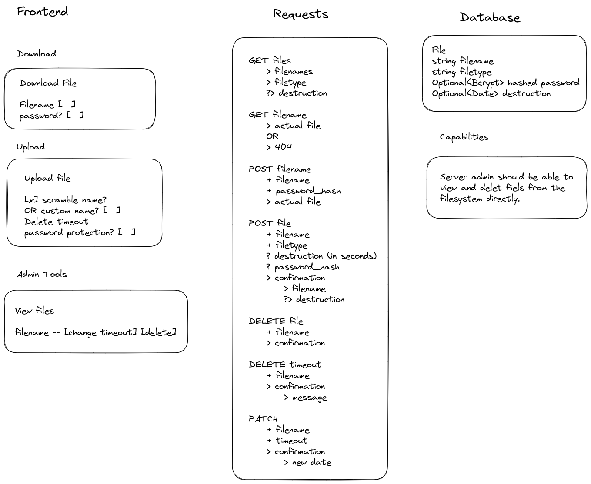

# Filesharing Tool

Current state is alpha. It has most of the functionality in place. I wouldn't recommend putting this into production yet.

## Screenshots

<table>
<tr>
	<td>
	<td>
	<td>
</table>

## Requirements

- View all files
- Delete files manually
- Password protection of files
- Optional name scrambling
- Optional destruction timeout
- Files should be accessible on disk

## License

The code is licensed under the AGPLv3 license. The icons in the `assets` folder are all public domain icons.

